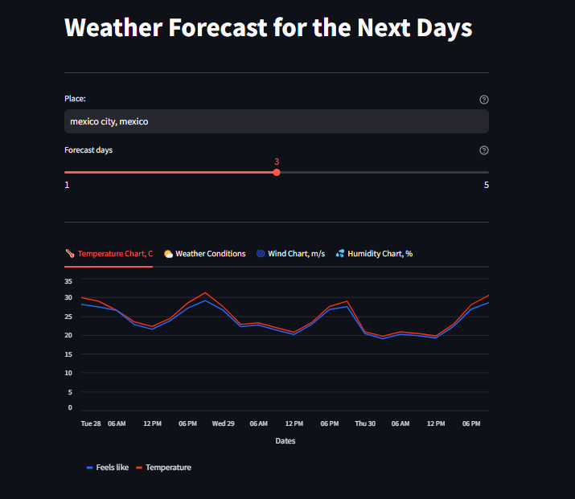
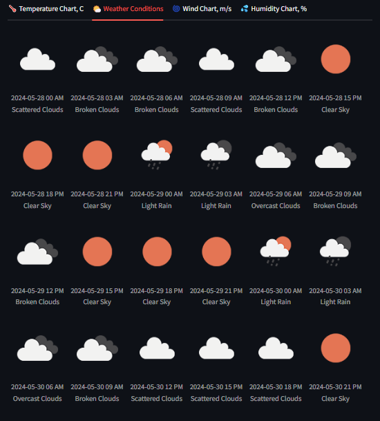
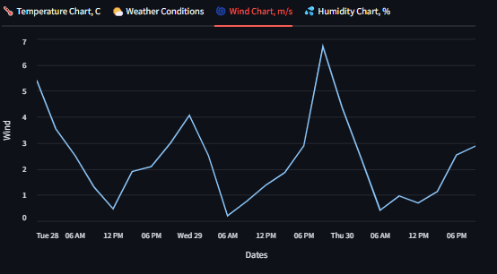
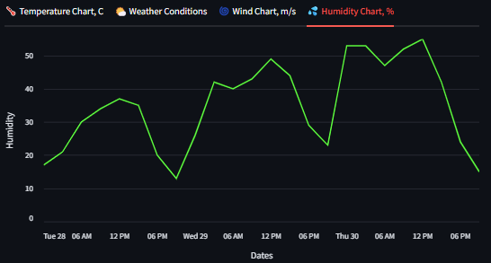

# Weather Forecast Dashboard (Streamlit)

Web-app amde with streamlit. The user can monitor temperature, wind, humidity, and a simple yet user-friendly tab for weather conditions on a dashboard that displays the user's selected city's predicted weather for up to five days in advance.

Since the interface and functionality are straightforward, the entire web portion of the project is built on streamlit.

The weather forecast is provided by [openweathermap.org]() API.

### How to use?

* Install requirements.txt
* Create a *.env* file in the root directory of the project and set the following variable:
  * *api_key* : [openweathermap.org]() API key
* Run with the command *streamlit run main.py*

### Screenshots:

